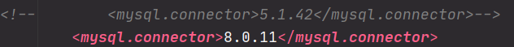
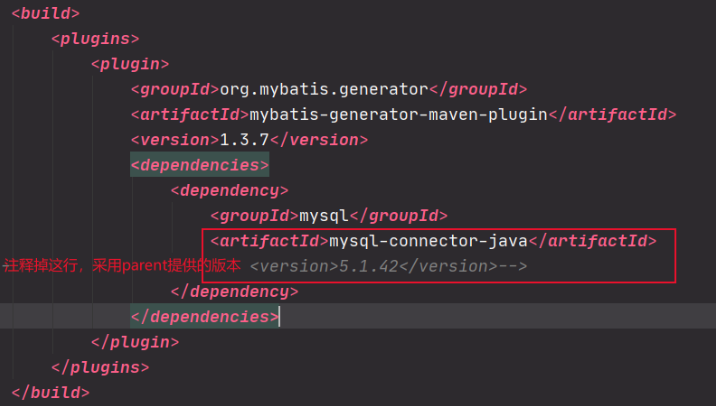

# Scaffold-Mybatis-Generator
# 1、项目描述

​		使用mybatis-generator-maven-plugin插件，通过mysql中的table或view生成相应的bean、mapper接口以及mapperXML文件。


# 2、构建步骤

## 2.1 创建数据库


## 2.2 导入mybatis-generator-maven-plugin插件

- pom.xml

```xml
<dependencies>

    <!-- https://mvnrepository.com/artifact/mysql/mysql-connector-java -->
    <dependency>
        <groupId>mysql</groupId>
        <artifactId>mysql-connector-java</artifactId>
        <version>${mysql.connector}</version>
    </dependency>

    <dependency>
        <groupId>org.springframework</groupId>
        <artifactId>spring-jdbc</artifactId>
        <version>4.3.8.RELEASE</version>
    </dependency>

    <!-- mybatis配置 -->
    <dependency>
        <groupId>org.mybatis</groupId>
        <artifactId>mybatis</artifactId>
        <version>${mybatis.version}</version>
    </dependency>

    <!-- MBG -->
    <dependency>
        <groupId>org.mybatis.generator</groupId>
        <artifactId>mybatis-generator-core</artifactId>
        <version>${mbg.version}</version>
    </dependency>


</dependencies>

<build>
    <plugins>
        <plugin>
            <groupId>org.mybatis.generator</groupId>
            <artifactId>mybatis-generator-maven-plugin</artifactId>
            <version>1.3.7</version>
            <dependencies>
                <dependency>
                    <groupId>mysql</groupId>
                    <artifactId>mysql-connector-java</artifactId>
                    <!--                        <version>5.1.42</version>-->
                    <version>8.0.15</version>
                </dependency>
            </dependencies>
        </plugin>
    </plugins>
</build>
```


## 2.3 编写mbg配置文件generatorConfig.xml

- generatorConfig.xml

```xml
<?xml version="1.0" encoding="UTF-8"?>
<!DOCTYPE generatorConfiguration
  PUBLIC "-//mybatis.org//DTD MyBatis Generator Configuration 1.0//EN"
  "http://mybatis.org/dtd/mybatis-generator-config_1_0.dtd">

<generatorConfiguration>

	<context id="MySQLTables" targetRuntime="MyBatis3">     <!--MyBatis3Simple-->
	
		<!--生成抑制，抑制所有的注释-->
		<commentGenerator>
			<property name="suppressAllComments" value="true"/>
		</commentGenerator>

		<!--com.mysql.cj.jdbc.Driver-->
		<!-- mvn mybatis-generator:generate 配置数据库位置 ，配置虚拟机上的mysql ip地址；不采用安全协议连接，否则无法逆向生成 -->
		<!--connectionURL="jdbc:mysql://ip地址:3306/数据库名称?useUnicode=true&amp;characterEncoding=UTF-8&amp;useSSL=false&amp;serverTimezone=GMT%2B8&amp;nullCatalogMeansCurrent=true"-->
		<jdbcConnection driverClass="com.mysql.cj.jdbc.Driver"
			connectionURL="jdbc:mysql://localhost/dbname?characterEncoding=UTF-8&amp;useSSL=false&amp;serverTimezone=GMT%2B8&amp;nullCatalogMeansCurrent=true"
			userId="root" password="example">
		</jdbcConnection>
		
		<!--字段是否强制decimal-->
		<javaTypeResolver>
			<property name="forceBigDecimals" value="false" />
		</javaTypeResolver>


		<!-- javaBean生成在哪里 -->
		<javaModelGenerator
			targetPackage="com.mybatis.generator.bean"
			targetProject="./src/main/java">
			<property name="enableSubPackages" value="true" />
			<property name="trimStrings" value="true" />
		</javaModelGenerator>

		<!-- sqlMap sql映射文件（xml mapper文件） -->
		<sqlMapGenerator targetPackage="mybatis.mapperXML"
			targetProject="./src/main/resources">
			<property name="enableSubPackages" value="true" />
		</sqlMapGenerator>

		<!-- javaClient：java接口生成的地方 -->
		<javaClientGenerator type="XMLMAPPER"
			targetPackage="com.mybatis.generator.mapper"
			targetProject="./src/main/java">
			<property name="enableSubPackages" value="true" />
		</javaClientGenerator>

		<!--对所有的表进行转换为bean-->
		<!--1、 全部生成，并且每个Bean还有相应的BeanExample-->
		<table schema="" tableName="%"></table>

		<!--2、 不生成Example -->
		<!--<table tableName="%" enableCountByExample="false"
			   enableDeleteByExample="false" enableUpdateByExample="false" enableSelectByExample="false"
			   selectByExampleQueryId="false" enableSelectByPrimaryKey="true" enableUpdateByPrimaryKey="true"
			   enableDeleteByPrimaryKey="true"></table>-->

		<!--3、 将指定表生成指定的实体-->
		<!--	<table schema="TAdmin" tableName="t_admin"></table>-->
	</context>
</generatorConfiguration> 
```


## 2.4 run maven

右击当前项目，run maven  => Plugins => mybatis-generator:generate


- 错误1：无法找到依赖的包

```bash
[ERROR] Failed to execute goal on project atcrowdfunding-main: Could not resolve dependencies for project ours.cafe.atcrowdfunding:atcrowdfunding-main:war:1.0-SNAPSHOT: Could not find artifact ours.cafe.atcrowdfunding:atcrowdfunding-manager-impl:jar:1.0-SNAPSHOT -> [Help 1]
```

找不到ours.cafe.atcrowdfunding:atcrowdfunding-main:war 包，所以需要对整个项目先install一下在parent项目上，maven install；解决发现的依赖问题。再在plugins所在的module上 run maven  => Plugins => mybatis-generator:generate


- 错误2：mybatis-generator-maven-plugin插件的认证插件错误

```bash
Failed to execute goal org.mybatis.generator:mybatis-generator-maven-plugin:1.3.7:generate (default-cli) on project atcrowdfunding-main: Unable to load authentication plugin 'caching_sha2_password'.
```

原因：可能是因为自己数据库用的8.0，

主要原因8.x版本的验证模块和之前版本不同：

5.x版本是：default_authentication_plugin=mysql_native_password

8.x版本就是：default_authentication_plugin=caching_sha2_password

网上的主要解决方案是：

1 修改mysql的配置文件为旧的模块

2 运行命令将某个用户的验证模块改为旧版的模块

但是我更建议用另外一种方案，更新mysql驱动的jar版本，可以修改为8.0.11版本



发现还是不行，最后发现plugin中依赖的mysqlconnector没有修改



- 错误3：生成了数据库中的所有表，生成了除了目标db外起他db中的table

解决方式：在连接mysql的url后加`&amp;nullCatalogMeansCurrent=true` ,即可。

```xml
jdbc:mysql://ip地址:3306/数据库名称?useUnicode=true&amp;characterEncoding=UTF-8&amp;useSSL=false&amp;serverTimezone=GMT%2B8&amp;nullCatalogMeansCurrent=true"
```


